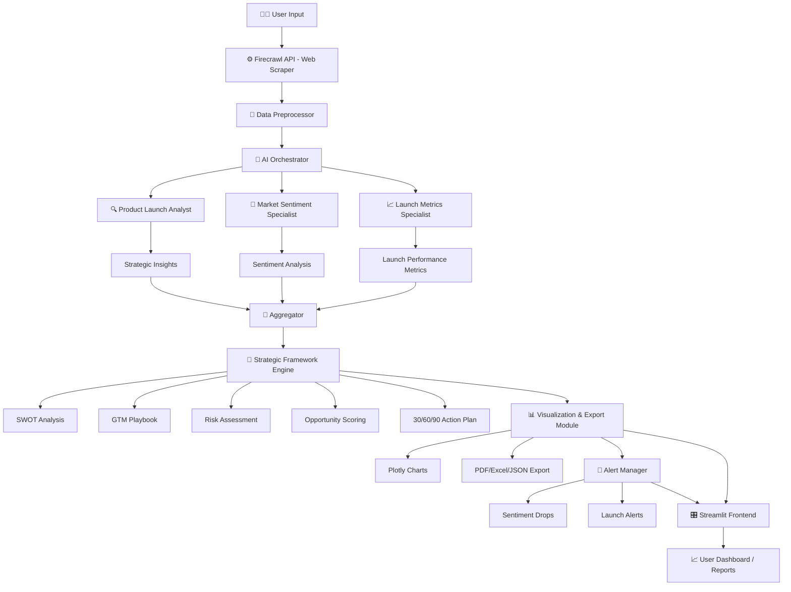

## APP DEMO VIDEO:--

https://github.com/user-attachments/assets/05565e02-5d81-413b-8336-9206764574ab


# 🚀 LaunchIQ Intelligence Platform

**AI Product LaunchIQ Intelligence Platform**  
✨ *Complete Competitive Intelligence & Strategic Planning Powered by AI* ✨

**Live demo:** https://market-launch-intelligence-platforms-01-agents.streamlit.app/

**Created:** November 7, 2025

---

## 🔎 Project Summary

**LaunchIQ Intelligence Platform** is a multi-agent AI application that helps product teams plan, analyze, and optimize product launches and go-to-market strategies. The platform combines real-time web intelligence, sentiment analysis, performance metrics, and structured strategic recommendations — all orchestrated by specialized AI agents.

Key goal: make evidence-driven launch decisions faster and more reliable.

---

## 🧭 Core Capabilities

- **Comprehensive competitor analysis** (tactics, positioning, strengths/weaknesses)
- **Real-time market sentiment tracking** across social media and review sources
- **Launch performance metrics** including adoption, engagement, revenue signals
- **Multi-company side-by-side comparisons**
- **Historical tracking & trend visualizations** with export options
- **Automated alerting** for sentiment or launch-related events
- **Actionable strategic outputs** (SWOT, GTM playbooks, 30/60/90 day plans)

---

## 🤖 Architecture & Core AI System

**Multi-Agent Architecture (3 Specialized AI Agents):**

1. **Product Launch Analyst**  
   - Role: Senior GTM strategist.  
   - Tasks: Evaluate competitor positioning, analyze launch tactics, produce evidence-driven competitive analysis and prioritized recommendations.

2. **Market Sentiment Specialist**  
   - Role: Consumer perception expert.  
   - Tasks: Scrape social media, reviews, and forums; compute sentiment drivers and trend changes; produce sentiment score (-100 to +100).

3. **Launch Metrics Specialist**  
   - Role: Performance analytics expert.  
   - Tasks: Track KPIs (adoption, retention, revenue), press coverage, virality metrics and translate them into growth insights.

**Primary model:** `GPT-4o-mini` (chosen for cost-efficiency; roughly ~94% cost savings compared to larger variants).  
**Model temperature:** `0.3` (balanced creativity & accuracy).  
**Web intelligence & scraping:** Firecrawl API (real-time scraping/data aggregation).

---

## 🧩 Feature Tabs (User-Facing)

**Tab 1: 🔍 Competitor Analysis**  
- Deep dives into competitor launches  
- Tactical, strategic & positioning analysis with source links  
- Actionable recommendations

**Tab 2: 💬 Market Sentiment Analysis**  
- Social media + review sentiment aggregation  
- Drivers of positive/negative sentiment  
- Brand perception monitoring & overall sentiment score (-100 to +100)

**Tab 3: 📈 Launch Metrics**  
- KPI dashboards (user adoption, retention, revenue growth)  
- Media & press monitoring  
- Traction and virality indicators

**Tab 4: ⚖️ Multi-Company Comparison**  
- Compare 2–5 companies side-by-side  
- Modes: Sentiment, Market Position, Launch Strategy  
- Comparative insights & recommendations

**Tab 5: 📊 Historical Tracking & Trends**  
- Stores last 100 analysis entries  
- Sentiment trend visualizations (Plotly)  
- Timeline, company filtering, CSV export

**Tab 6: 🔔 Alert Manager**  
- Custom alerts (sentiment drops/spikes, new product launches)  
- Thresholds configurable (5–50%)  
- Active dashboard; email notifications marked as "future feature"

**Tab 7: 📊 Visualizations & Export Suite**  
- Interactive charts: sentiment gauges, word freq, keywords/themes  
- Export: PDF, Excel (multi-sheet), JSON, Markdown

**Tab 8: 🎯 Strategic Recommendations Generator**  
- Outputs using 5 frameworks:  
  - SWOT Analysis  
  - GTM Playbook  
  - Risk Assessment Matrix (probability × impact)  
  - Opportunity Scoring (prioritized)  
  - 30/60/90 Day Action Plan

---

## 🛠️ Tech Stack (suggested / current)

- **Frontend:** Streamlit (live app link above)  
- **AI / LLMs:** GPT-4o-mini (via OpenAI API)  
- **Web intelligence:** Firecrawl API for scraping/real-time web data  
- **Visualizations:** Plotly for interactive charts  
- **Data storage:** Lightweight DB or file store for history (CSV/JSON)  
- **Deployment:** Streamlit Cloud / any containerized host

---

## ⚙️ Installation (developer/local)

> _Replace `FIRECRAWL_API_KEY` and `OPENAI_API_KEY` with your own keys._

```bash
git clone <your-repo-url>
cd launchiq-intelligence-platform
python -m venv .venv
source .venv/bin/activate  # or .venv\Scripts\activate on Windows
pip install -r requirements.txt

# env vars
export OPENAI_API_KEY="sk-..."
export FIRECRAWL_API_KEY="fc-..."

streamlit run app.py

---

## 🧩 **LangGraph / Tree Flow — Logical Architecture**

### 🌐 High-Level Structure

LaunchIQ Intelligence Platform
│
├── 🧠 AI Orchestrator
│   │
│   ├── 🔍 Product Launch Analyst (Agent 1)
│   │   ├── Input: Competitor data, launch keywords
│   │   ├── Process: Positioning evaluation, SWOT extraction
│   │   └── Output: Strategic insights + recommendations
│   │
│   ├── 💬 Market Sentiment Specialist (Agent 2)
│   │   ├── Input: Web data, reviews, social media text
│   │   ├── Process: Sentiment scoring, trend tracking
│   │   └── Output: Sentiment index (-100 → +100), perception report
│   │
│   └── 📈 Launch Metrics Specialist (Agent 3)
│       ├── Input: Press releases, analytics feeds
│       ├── Process: KPI extraction, engagement & revenue metrics
│       └── Output: Market traction report
│
├── ⚙️ Integration Layer
│   ├── 🔗 Firecrawl API (Real-time Web Scraper)
│   ├── 🧾 Data Preprocessor (cleaning, normalization)
│   ├── 🧮 Aggregator (merges agent outputs)
│   └── 🧩 Prompt Engine (feeds structured prompts to GPT-4o-mini)
│
├── 🧭 Strategic Framework Engine
│   ├── SWOT Analyzer
│   ├── GTM Playbook Generator
│   ├── Risk Matrix Evaluator
│   ├── Opportunity Scorer
│   └── 30/60/90 Action Plan Builder
│
├── 📊 Visualization & Export Module
│   ├── Plotly Dashboard Renderer
│   ├── PDF & Excel Exporter
│   └── JSON / Markdown Data Export
│
├── 🔔 Alert Manager
│   ├── Sentiment Threshold Monitor
│   ├── Launch Event Detector
│   └── Alert Queue & (Future) Email Notifier
│
└── 🎛️ User Interface (Streamlit Frontend)
    ├── Input Forms (Company / Product)
    ├── 8 Functional Tabs (Analysis, Comparison, History, etc.)
    ├── Interactive Charts
    └── Executive Reports
```

---

## 🧠 **LangGraph Node-Edge Representation (Mermaid Diagram)**

If you want to **show this on GitHub**, paste the code below directly into your `README.md`.
GitHub automatically renders **Mermaid diagrams**.



---

## 🌳 **Tree Explanation**

* **Root Node:** `LaunchIQ Intelligence Platform`

  * **Branch 1: Data Acquisition Layer**

    * `Firecrawl API` → gathers real-time web + social data.
  * **Branch 2: AI Reasoning Layer**

    * `AI Orchestrator` distributes queries to 3 specialized agents.

      * **Agent 1:** `Product Launch Analyst` → competitive strategy.
      * **Agent 2:** `Market Sentiment Specialist` → perception analytics.
      * **Agent 3:** `Launch Metrics Specialist` → adoption and revenue trends.
  * **Branch 3: Framework Engine**

    * Fuses results into structured strategy models (SWOT, GTM, Risk, etc.).
  * **Branch 4: Visualization & Alerts**

    * Generates dashboards, charts, and reports.
    * Monitors changes in brand sentiment or launch events.
  * **Branch 5: Streamlit UI Layer**

    * Presents all results interactively through 8 tabs.

---

## ⚡ **LangGraph Conceptual Node Hierarchy**

| Node                        | Type            | Function                  | Output                    |
| --------------------------- | --------------- | ------------------------- | ------------------------- |
| User Input                  | Root            | Query trigger             | Company / product context |
| Firecrawl API               | Source Node     | Data ingestion            | Raw data JSON             |
| Data Preprocessor           | Transformer     | Cleaned text, metrics     | Normalized data           |
| AI Orchestrator             | Controller Node | Dispatches tasks          | Agent outputs             |
| Product Launch Analyst      | Agent Node      | Competitive analysis      | Strategic insights        |
| Market Sentiment Specialist | Agent Node      | Sentiment analysis        | Sentiment index           |
| Launch Metrics Specialist   | Agent Node      | KPI analysis              | Market metrics            |
| Aggregator                  | Combiner Node   | Merges multi-agent output | Unified intelligence      |
| Framework Engine            | Strategy Node   | Generates frameworks      | SWOT / GTM / Risk         |
| Visualization Module        | Renderer Node   | Creates visuals           | Charts / Exports          |
| Alert Manager               | Reactive Node   | Triggers alerts           | Threshold warnings        |
| Streamlit Frontend          | Interface Node  | Displays results          | Reports, dashboards       |

---

## 🧩 **How to Integrate This Diagram into GitHub**

1. Copy the **Mermaid code block** above.
2. Paste it inside your `README.md` (GitHub renders it automatically).
3. Commit with message:

   ```
   docs: add LangGraph architecture and process tree diagram
   ```
4. Optionally, export the diagram from [https://mermaid.live](https://mermaid.live) as a PNG/SVG and upload it to your repo `/assets/` folder.

---

## ❤️ **Made with Passion by Abhishek Yadav & Open-Source Contributors!** 🚀✨


<h1 align="center">© LICENSE </h1>

<table align="center">
  <tr>
     <td>
       <p align="center"> </img>
    </td>
    <td> 
       <br> 
This project is licensed under <a href="./LICENSE">MIT</a>. 
    </td>
  </tr>
</table>


 <hr>

<div align="center">
<a href="#"></a>
	
### **Thanks for checking out my GitHub Profile!**  

 ## 💌 Sponser

  [](https://www.buymeacoffee.com/abhishekkumar62000)

## 👨‍💻 Developer Information
**Created by **Abhishek kumar** 
**📧 Email**: [abhiydv23096@gmail.com](mailto:abhiydv23096@gmail.com)  
**🔗 LinkedIn**: [Abhishek Kumar](https://www.linkedin.com/in/abhishek-kumar-70a69829a/)  
**🐙 GitHub Profile**: [@abhishekkumar62000](https://github.com/abhishekkumar62000)  
**📸 Developer Profile Image**:- 


</div>  


`Don't forget to give A star to this repository ⭐`


`👍🏻 All Set! 💌`

</div>

---
